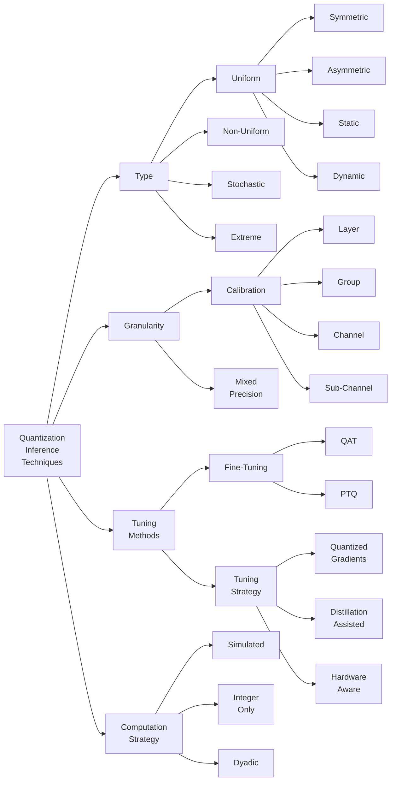
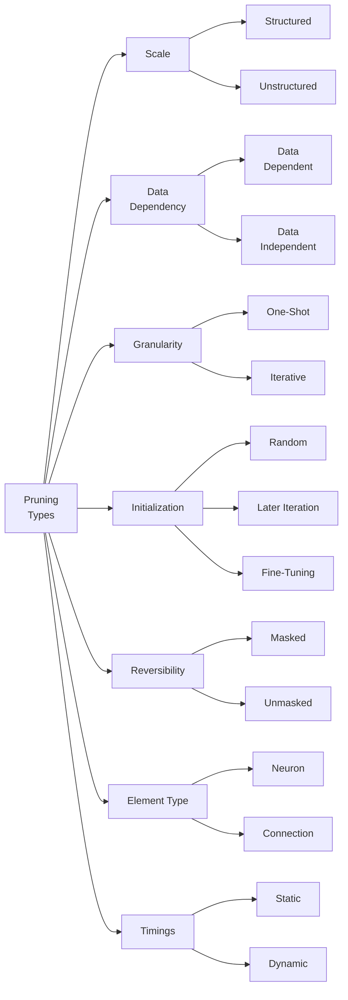
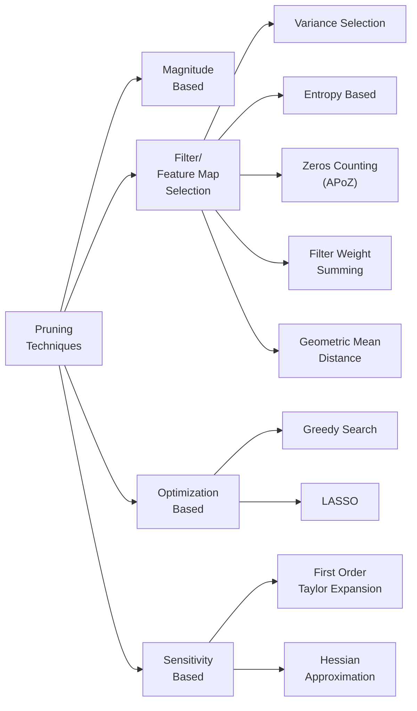

  <a href="https://discord.gg/RbeQMu886J">Join the community</a> •
  <a href="#contribute">Contribute to the library</a>

# Learning AI optimization
This library aims to become a curated list of awesome material (cool papers, tutorials, courses, etc.) on optimization techniques to make artificial intelligence faster and more efficient 🚀 

Among the best acceleration techniques for deep learning are:
- [ ] Deep learning compilers
- [x] [Quantization](#quantization)
- [ ] Sparsity
- [ ] Distillation
- [ ] Cached datasets

And many others. Do you have any idea on material to expand the list? We are welcoming contributions! And don't forget to leave a star if you found this library insightful ⭐

# Contribute

We welcome support from the open-source community in any form 🥰

We have recently published this library. We will continue to update and upgrade it with great material on how to accelerate artificial intelligence models and make them ever more efficient. We also hope you will also learn with us and help us keep the library populated with the best quality content.

Open an [issue](https://github.com/nebuly-ai/learning-AI-optimization/issues) or drop a message in the <a href="https://discord.gg/jyjtZTPyHS">community</a> channel to
- Add topics you would like to be covered
- Ask any questions
- Report a typo
- Propose to include your research work

Fork the library, make the changes, and send us a [pull request](https://github.com/nebuly-ai/learning-AI-optimization/pulls) in case you want to
- Write new content on AI optimization
- Correct or improve some sections

Currently, the main contributor to the library is [Pier](https://www.linkedin.com/in/pierpaolo-sorbellini-64603012b/), and the library would not have been possible without [Diego](https://www.linkedin.com/in/diego-fiori-b64b3016a/)'s interesting insights and topic suggestions and support from the <a href="https://discord.gg/jyjtZTPyHS">community</a>. 

# The community for AI acceleration

Do you want to meet the contributors of this libraries and other developers who share the vision of an superfast and sustainable artificial intelligence? <a href="https://discord.gg/jyjtZTPyHS">Join the community</a> for AI acceleration on Discord!

# Quantization
The complexity of NN models has increased significantly, which means that they cannot be used for many applications with limited resources, or even if possible, large computational resources and power are required.
Various types of optimizations are introduced for this purpose, quantization being one of them.
Quantization is a method of mapping floating-point values into integer values; a reduction in memory cost is automatically generated by the smaller amount of bits required to store the quantized value, while the decrease in energy and increase in computational speed depends on the way the operations are performed on the hardware (e.g., performing INT8 addition is 30 times more energy efficient and 116 times more area efficient than FP32 addition).
Quantization is one of the methods that can be used to compress a neural network, either during training or inference.
The application of quantization during training is quite complex and must be carefully managed to avoid divergence during training, so the most extreme quantization strategies are typically applied for inference. 
During quantization in neural networks, unlike what is commonly done in signal compression, the key aspect that must be preserved is not the precise representation of the quantized value, but accuracy. The goal is to reduce the accuracy of the parameters and activation maps, with minimal impact on the generalization/accuracy power of the model.

## Quantization techniques

Quantization techniques can be clustered by
-  [Type](#types)
-  [Granularity](#granularity)
-  [Tuning method](#fine-tuning-methods)
-  [Computational strategy](#computation-strategy)

## Types

### Uniform
General quantization can be expressed as:

$$Q(r)=Int(r/S) - Z$$ 

Where:  
* $r$ is the floating point value to be quantized.
* $S$ is the scaling factor that maps the floating point value in the appropiate range for quantization.
* $Z$ is an integer applied to set the zero-point of the quantized representation.
  
And is said uniform since the spacing between two quantized values is fixed and imposed by $S$.

The scaling factor is computed as:

$$S=\frac{\beta - \alpha}{2^b - 1}$$

Where:

* $\beta$ is the upper bound that the quantized number needs to represent $r_{max}$.
* $\alpha$ is the lower bound that the quantized number needs to represent $r_{min}$.
* $b$ is the bit-width of the quantized value.

The process of selecting $a$ and $b$ is said **calibration**.

### Symmetric
In Symmetric Quantization 
$$|\beta| = |\alpha| = max(|r_{max}|,|r_{min}|)$$

This has the advantage of eliminating the need to compute $Z$ since the mapping is already centered in $0$. However, some of the resolution is wasted on representing values that are not interesting, since typically $|r_{max}| \neq|r_{min}|$.

### Asymmetric
In Asymmetric Quantization the most trivial choise could be:

$$\beta = r_{max}$$
$$\alpha = r_{min}$$

However more complex strategy can be used to improve the resolution at the price of losing some representation capability for the extreme values. Typical choise are:
* picking a percentile of the full-range.
* minimizing the K/L divergence.

The parameter $Z$ must be computed, but the accuracy of the representation is improved. This strategy is particularly effective when the constraints are strongly asymmetric, as in the case of ReLU, and $Z$ can be incorporated into the activation bias. 

### Static and Dynamic
The weights, once calculated as quantized values, their value does not change and the quantization is always static. However, the quantization of activation maps depends on the inputs and the range is not known a priori. Several strategies can be adopted in this case:

* *Dynamic Quantization:* the ranges are computed during run-time introducing overhead but high accuracy. 
* Run a series of input samples to determine resonable ranges.
* Calibrate the quantization during training.

### Non-Uniform
Instead of using a linear scale more complex strategies can be used:

* Logaritmic scale
* code-based: the quantization is expressed as a real linear combination of binary vectors. 
* computing ad-hoc scales by minimizing an optimization problem that is jointly trained with the model.
  
### Stochastic
Noting that small updates to the weights may not result in any change, since the rounding operation may always return the same weights. Different approaches can be used to avoid this situation, such as imposing that the rounding operation has a certain probability of generating an upper or lower value in the quantized scale with a certain probability. The disadvantage is that generating random numbers and evaluating this probability distribution involves some overhead. 

### Extreme
Extreme quantization occurs when the amplitude of the quantization bits is set as binary $[-1,1]$ or ternary $[-1,0,1]$ in combination with binary or ternary activation maps; usually ReLu and other activations can also be transformed into a $sign$ function. The increase in overall performance can be considerable if the hardware is well optimized for these operations; in practice any multiplication can be transformed into a simple logical XOR. Usually this type of approach also requires the use of mixed precision to avoid the loss of too much accuracy. Ternary quantization allows the zero representation to be retained, which can be used to avoid unnecessary calculations or to perform pruning and further optimization.

## Granularity

### Calibration Granularity
The granualarity used to compute the ranges $[\alpha,\beta]$ can be different:  
* **Layer** 
* **Group:** a subset of channel. 
* **Channel** 
* **Sub-Channel:** any group of parameters.

Usually the standard is to use the channel. 

### Mixed Precision
Each layer is quantized with a different bit precision and is usually done when using binary or ternary representations for quantization. The selection of this mixed precision for each layer is essentially a search problem. Typical approaches to selecting the number of bits for layer quantization are:

* Reinforment Learning.
* Second order sensitivity (Hessian) can measure the sensitivity of a layer to quantization.
* Linear Programming approaches.

## Fine-Tuning Methods

### PTQ - Post Training Quantization
PTQ consists of floating-point training and quantizing only at the end. The drop in accuracy is usually nontrivial, and some methods are used to reduce the impact of quantization:

* Equalizing the weight ranges (and implicitly activation ranges) between different layers or channels.
* Optimizing the L2 distance between the quantized tensor and the corresponding floating point tensor.
* Adapting rounding strategies instead of round-to-nearest.

### QAT - Quantization Aware Training
The main idea is to train again with quantized parameters to improve accuracy. The parameters are quantized after each gradient update. To recover accuracy, it may be necessary to perform this retraining for several hundred epochs, especially in the case of low bit-precision quantization. However, QAT produces higher accuracy than PTQ at the expense of higher overhead.

The quantization operator is not differentiable and is typically flat piecewise, so it has zero gradient. The so-called Straight Through Estimator (STE) is used to solve this problem.
The main idea is to treat the quantization gradient as an identity function. Other STE and non-STE approaches have also been proposed. 

## Tuning Strategy

### Hardware-Aware Quantization
The benefits of quantization are hardware-dependent, so the recent trend is to identify the type of quantization that can be performed based on the hardware specifications on which the model is deployed. A typical approach is to use an agent that learns which quantization steps can be performed.

### Distillation Assisted
The main idea is to incorporate model distillation to boost quantization accuracy.

### Improved Loss Function
Directly minimize the loss versus weights to improve the accuracy of determining the correct weights versus loss function instead of the accuracy of representing floating-point values.

### Quantized Gradient
To improve training time one apporach proposed is to quantize the gradients as well. 

## Computation Strategy

### Simulated 
In simulated quantization, quantized model parameters are stored in low precision, but operations (matrix multiplications and convolutions) are performed with floating-point arithmetic. Therefore, the quantized parameters must be dequantized before the floating-point operations.

### Integer-Only
In integer-only quantization, all operations are performed using low-precision integer arithmetic. Low-precision logic has many advantages over its full-precision counterpart in terms of latency, power consumption and area efficiency.

### Dyadic
All scaling operations are performed with dyadic numbers, that is, rational numbers with integer values at the numerator and a power of 2 at the denominator. This means that scaling can be performed simply by applying bitshift operations, which are extremely more efficient than divisions. All addition must have the same dyadic scale, which makes the logic of addition simpler and more efficient.

# Interesting material on quantization 

## HAWQV3: Dyadic Neural Network Quantization

[This Berkeley paper](https://arxiv.org/abs/2011.10680) proposes an approach to quantization with mixed dyadic symmetric and asymmetric quantization. It suggests an interesting strategy for selecting the quantization scheme of different layers using hardware-dependent metrics. The library is available at [HAWQ GitHub](https://github.com/Zhen-Dong/HAWQ/blob/main/ILP.ipynb).

The paper opens up many questions, and below are just a few of them.

* What are the limitations of the approach proposed in the paper? Is there room for improvement?
* Are there better schemes for performing quantization?
* Is it possible to implement this quantization approach in [nebullvm](https://github.com/nebuly-ai/nebullvm)?

Let us know your views on this topic, either by opening an issue or dropping a message on <a href="https://discord.gg/RbeQMu886J">the community channel</a>.

# Pruning
The pruning algorithm usually can be divided in three main parts: 
* The selection of the parameters to prune. 
* The methodology to perfom the pruning. 
* The fine-tuning of the remaining parameters. 

## Pruning a way to Find the "Lottery Ticket"
Given a network, the lottery ticket hypothesis suggests that there is a subnetwork that is at least as accurate as the original network. Pruning, which is a technique of removing weights from a network without affecting its accuracy, aims to find this lottery ticket. 
The main advantages of a pruned network are:
* the model is smaller: it has fewer weights and therefore occupies a smaller portion of memory. 
* The model is faster: the smaller weights can reduce the amount of FLOPS of the model. 
* The training of the model is faster. 

These "winning tickets" or subnetworks are found to have special properties:
 * They are independent of the optimizer. 
 * They are transferable between similar tasks. 
 * The winning tickets of large-scale tasks are more transferable.

## Pruning Types
Various pruning technique have been proposed in the licterature, here an attempt to cathegorized the common traits is proposed. 

### Scale: Structured Vs Unstructured 
Unstructured pruning occurs when the weights to be pruned are individually targeted without taking into account the layer structure. This means that the selection of weights to prune is easy once the principle for doing so is defined.  Since the layer structure is not taken into account, this type of pruning may not improve the performance of the model. The typical case is that as the number of pruned weights increases, the matrix becomes more and more sparse; sparsity requires ad hoc computational techniques that may produce even worse results if the tradeoff between representation overhead and amount of computation performed is not balanced. For this reason, the performance increase with this type of pruning is usually only observable for a high pruning ratio. 
Structured Pruning, instead of focusing on individual weights, attempts to prune an entire structure by producing a more ordered sparsity that is computationally easier to handle, sacrificing the simplicity of the pruning algorithm. 

### Data Dependency: Data Dependent Vs Data Indipendent
Distinction between pruning techniques that use only weight as information for the pruning algorithm (Data Indipendet) and techniques that perform further analysis that require some input data to be provided (Data Dependent). Usually data-dependent techniques, because they require performing more calculations, are more costly in terms of time and resources. 

### Granularity: One-shoot Vs Iterative
One-shot techniques establish a criterion, such as the amount of pruning weight or model compression, and perform pruning in a single pass. Iterative techniques, on the other hand, adapt their learning and pruning ratio through several training epochs, usually producing much better results in terms of both compression achieved and accuracy degradation. 

### Initialization: Random, Later Iteration, Fine-Tuning
Especially when performing iterative pruning, with different pruning ratios, there are several possibilities to set the initial weight between pruning steps, which can be set randomly each time, or maintained from the previous epoch by fine-tuning the remaining weights to balance those being pruned. Another technique is to take a later iteration as a starting point, using a trade-off between random and maintaining the same from the previous epoch; in this way the model has more freedom to adapt to the pruned weight and generally adapts better to change. 

### Reversibility: Masked Vs Unmasked
One of the problems with pruning is that some of the weights that are removed in the first iterations may actually be critical, and their saliency may be more pronounced as pruning increases. Some techniques therefore, instead of removing the weights completely, adopt a masking technique that is able to maintain and restore the value of the weights if in a later iteration they start to become relevant. 

### Element Type: Neuron Vs Connection
Simply the different types of pruned element, that could be a connection between two neurons or directly the entire neuron that is pruned. 

### Timing: Dynamic Vs Static
Dynamic pruning is performed at runtime introducing some overhead but can be adaptivly perfomed per computation, Static pruning is performed offline before deploying the model

## Pruning Techniques

### Magnitude Based: Simple, Regularized.
Under the hypothesis that smaller weight have a minor impact on the model accuracy the weight that are smaller of a given threshold are pruned. To enforce the weight to be pruned some regularization can be applied. Usualy $L_1$ norm is better right after pruning while $L_2$ works better if the weight of the pruned network are fine-tuned. 

### Inboud Pruning [[1]](#1)
The input pruning method targets the number of channels on which each filter operates. The amount of information each channel brings is measured by the variance of the activation output of the specific channel.

$$ \sigma_{ts} = var(|| W_{ts} * X_{s} ||_F) $$

Where $t$ is the filter, $s$ the activation channel.  
Pruning of the entire network is performed sequentially on the layers of the network: from lower to higher layers, pruning is followed by fine-tuning, which is followed by pruning of the next layer. Speeding up the input pruning scheme is directly achieved by reducing the amount of computation that each filter performs.

### Reduce and Reuse [[1]](#1)
To find candidates for pruning, the variance of each filter output on a sample of the training set is calculated. Then, all filters whose score is less than the percentile $\mu$ are eliminated.

$$ \sigma_{t} = var(|| W_{t} * X ||_F) $$

The pruning performed requires adaptation, since the next layer expects to receive inputs of the size prior to pruning and with similar activation patterns. Therefore, the remaining output channels are reused to reconstruct each pruned channel, through the use of linear combinations.

$$ A = min_{A} \left(\sum_i || Y_i - A Y'_i) ||_2^2 \right)$$

Where $Y_i$ is the output before pruning, $Y'_i$ is the output after pruning, and $i$ are the iterations on the input samples, each input sample producing different activations.  
The operation of A is added to the network by introducing a convolution layer with filters of size 1 × 1, which contains the elements of A.

### Entropy Based Pruning [[2]](#2)
Entropy-based metric to evaluate the weakness of each channel: a larger entropy value means the system contains more information. First is used global average pooling to convert the output of layer $i$, which is a $c \times h \times w$ tensor, into a $1 \times c$ vector. In order to calculate the entropy, more output values need to be collected, which can be obtained using an evaluation set.
Finally, we get a matrix $M \in R^{ n \times c}$, where $n$ is the number of images in the evaluation set, and $c$ is the channel number. For each channel $j$, we would pay attention to the distribution of $M[:,j]$. To compute the entropy value of this channel, we first divide it into $m$ different bins, and calculate the probability of each bin. 
The entropy is then computed as

$$ H_j = - \sum_i^m p_i log(p_i) $$

Where, $p_i$ is the probability of bin $i$, $H_j$ is the entropy of channel $j$. Whenever one layer is pruned, the whole network is fine-tuned with one or two epochs to recover its performance slightly. Only after the final layer has been pruned, the network is fine-tuned carefully with many epochs.

### APoZ [[3]](#3)
It is defined Average Percentage of Zeros (APoZ) to measure the percentage of zero activations of a neuron after the ReLU mapping. $APoZ_c^{(i)}$ of the $c-th$ neuron in $i-th$ layer is defined as:

$$ APoZ_c^{(i)} =  \frac{\sum_k^N \sum_j^M f(O_{c,j}^{(i)}(k))}{N \times M}$$

Where, $O_c^{(i)}$ denotes the output of the $c-th$ neuron in $i-th$ layer, $M$ denotes the dimension of output feature map of $O_c^{(i)}$ , and $N$ denotes the total number of validation examples. While $f(\cdot)$ is a function that is equal to one only if $O_c^{(i)} = 0$ and zero otherwise.  
The higher mean APoZ also indicates more redundancy in a layer. Since a neural network has a multiplication-addition-activation computation process, a neuron which has its outputs mostly zeros will have very little contribution to the output of subsequent layers, as well as to the final results. Thus, we can remove those neurons without harming too much to the overall accuracy of the network.  
Empirically, is found that starting to trim from a few layers with high mean APoZ, and then progressively trim its neighboring layers can rapidly reduce the number of neurons while maintaining the performance of the original network. Pruning the neurons whose APoZ is larger than one standard derivation from the mean APoZ of the target trimming layer would produce good retraining results.

### Filter Weight Summing [[4]](#4)
The relative importance of a filter in each layer is measured by calculating the sum of its absolute weights.

$$ s_j = \sum |F_{i,j}|$$

This value gives an expectation of the magnitude of the output feature map. Then each filter is sorted based on $s_j$, and $m$ are pruned togheter with the kernels in next layer corresponding to the prenued features. After a layer is pruned, the network is fine-tuned, and pruning is continued layer by layer.

### Geometric Median [[5]](#5)
The geometric median is used to get the common information of all the filters within the single ith layer:

$$ x^{GM} = \argmin_x \sum_{j'} || x - F_{i,j'} ||_2$$
$$ x \in R ^ {N_i \times K \times K} $$
$$ j'\in [1, N_{i+1}] $$

Where $N_i$ and $N_{i+1}$, to represent the number of input chan-nels and the output channels for the $i-th$ convolution layer, respectively. $F_{i,j}$ represents the $j-th$ filter of the $i-th$ layer, then the dimension of filter $F_{i,j}$ is $N_i \times K \times K$, where $K$ is the kernel size of the network.

Then is found the filters that are closer to geometric mean of the filters and pruned since it can be represented by the other filters.

Such computations is rather complex than instead is possible to find which filter minimizes the summation of the distance with other filters. 

$$ F_{i,x^*} = \argmin_x \sum_{j'} || x - F_{i,j'} ||_2$$
$$ x \in [F_{i,1} \dots  F_{i,N_{i+1}}] $$
$$ j'\in [1, N_{i+1}] $$

Since the selected filter(s), $F_{i,x^*}$ , and left ones share the most common information. This indicates the information of the filter(s) $F_{i,x^*}$ could be replaced by others.

## References

<a id="1">[1]</a> 
Polyak, Adam and Wolf, Lior, ["Channel-level acceleration of deep face representations"](https://ieeexplore.ieee.org/document/7303876), in IEEE Access (2015). 

<a id="2">[2]</a>
Luo, Jian-Hao, and Jianxin Wu, ["An Entropy-based Pruning Method for CNN Compression"](https://arxiv.org/abs/1706.05791), in arXiv preprint arXiv:1706.05791 (2017).

<a id="3">[3]</a>
Hu, H., Peng, R., Tai, Y. W., & Tang, C. K., ["Network Trimming: A Data-Driven Neuron Pruning Approach towards Efficient Deep Architectures"](https://arxiv.org/abs/1607.03250) in arXiv preprint arXiv:1607.03250 (2016).

<a id ="4">[4]</a>
Li, H., Kadav, A., Durdanovic, I., Samet, H., & Graf, H. P. ["Pruning filters for efficient convnets"](https://arxiv.org/abs/1608.08710). arXiv preprint arXiv:1608.08710 (2016).

<a id ="5">[5]</a>
He, Y., Liu, P., Wang, Z., Hu, Z., & Yang, Y. . ["Filter pruning via geometric median for deep convolutional neural networks acceleration"](https://arxiv.org/abs/1811.00250). In Proceedings of the IEEE/CVF conference on computer vision and pattern recognition (2019).

  <a href="https://discord.gg/RbeQMu886J">Join the community</a> •
  <a href="#contribute">Contribute to the library</a>

