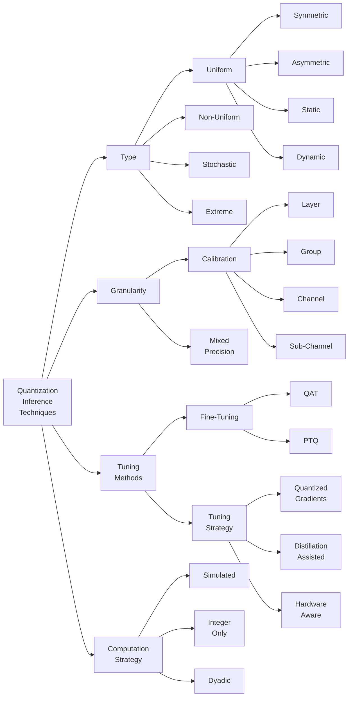

  <a href="https://discord.gg/RbeQMu886J">Join the community</a> •
  <a href="https://github.com/nebuly-ai/learning-AI-optimization#contribute">Contribute to the library</a>

# Overview

Here we will explore
- <a href="#what-is-neural-network-quantization">Fundamentals</a>
- <a href="#quantization-techniques">Overview of quantization techniques</a>
- <a href="https://github.com/nebuly-ai/learning-AI-optimization/blob/main/quantization-resources.md">Papers, blogs and other resources</a>

## What is neural network quantization?

Over the years, the evolution of neural networks has progressed towards larger models. Although the accuracy of these models has increased significantly, these large models often cannot be implemented for many applications with limited resources that require real-time inference, low power consumption, or are limited in computing capacity or budget.

To overcome this challenge, various types of optimizations are introduced, quantization being one of them. The intuition behind quantization is to create a more compact representation of the neural network by reducing the precision of weights, biases and/or activations below the standard floating-point precision. This technique reduces the memory required to store tensors, data movement between memories and processors and enables faster computations without sacrificing too much accuracy.

### Key takeways

- Quantization is the process of reducing the precision of neural network weights, biases and/or activations to cut the cost of storing, transporting and computing data during neural network inference and training.
- Quantization yields lower latency / higher throughput, reduced model size, memory footprint and power consumption, at the cost of small deterioration in model accuracy.
- Quantization is primarily applied during inference, as training requires higher precision. It is also possible to perform quantization-aware training to directly produce a quantized model at the end of training.
- Typically, quantization means mapping model parameters from 32 bits floating point to 16 or 8 bits, and it is also possible to go down to a 1-bit quantization.
- Quantization requires hardware or software that can effectively support lower precision model parameters. Many frameworks such as PyTorch and TensorFlow support quantization natively, and libraries like nebullvm make you leverage quantization on any framework and hardware.

## More resources

See the [resource page on quantization](https://github.com/nebuly-ai/learning-AI-optimization/blob/main/quantization-resources) and check out the best literature reviews, papers, courses and blogs, and open-source libraries on this topic.

## Quantization techniques

Quantization techniques can be clustered by

- [1. Type](#types)
- [2. Granularity](#granularity)
- [3. Tuning method](#fine-tuning-methods)
- [4. Computational strategy](#computation-strategy)

## 1. Types

### 1.1 Uniform
General quantization can be expressed as:

$$Q(r)=Int(r/S) - Z$$ 

Where:  
* $r$ is the floating point value to be quantized.
* $S$ is the scaling factor that maps the floating point value in the appropiate range for quantization.
* $Z$ is an integer applied to set the zero-point of the quantized representation.
  
And is said uniform since the spacing between two quantized values is fixed and imposed by $S$.

The scaling factor is computed as:

$$S=\frac{\beta - \alpha}{2^b - 1}$$

Where:

* $\beta$ is the upper bound that the quantized number needs to represent $r_{max}$.
* $\alpha$ is the lower bound that the quantized number needs to represent $r_{min}$.
* $b$ is the bit-width of the quantized value.

The process of selecting $a$ and $b$ is said **calibration**.

### Symmetric
In Symmetric Quantization 
$$|\beta| = |\alpha| = max(|r_{max}|,|r_{min}|)$$

This has the advantage of eliminating the need to compute $Z$ since the mapping is already centered in $0$. However, some of the resolution is wasted on representing values that are not interesting, since typically $|r_{max}| \neq|r_{min}|$.

### Asymmetric
In Asymmetric Quantization the most trivial choise could be:

$$\beta = r_{max}$$
$$\alpha = r_{min}$$

However more complex strategy can be used to improve the resolution at the price of losing some representation capability for the extreme values. Typical choise are:
* picking a percentile of the full-range.
* minimizing the K/L divergence.

The parameter $Z$ must be computed, but the accuracy of the representation is improved. This strategy is particularly effective when the constraints are strongly asymmetric, as in the case of ReLU, and $Z$ can be incorporated into the activation bias. 

### Static and Dynamic
The weights, once calculated as quantized values, their value does not change and the quantization is always static. However, the quantization of activation maps depends on the inputs and the range is not known a priori. Several strategies can be adopted in this case:

* *Dynamic Quantization:* the ranges are computed during run-time introducing overhead but high accuracy. 
* Run a series of input samples to determine resonable ranges.
* Calibrate the quantization during training.

### 1.2 Non-Uniform
Instead of using a linear scale more complex strategies can be used:

* Logaritmic scale
* code-based: the quantization is expressed as a real linear combination of binary vectors. 
* computing ad-hoc scales by minimizing an optimization problem that is jointly trained with the model.
  
### 1.3 Stochastic
Noting that small updates to the weights may not result in any change, since the rounding operation may always return the same weights. Different approaches can be used to avoid this situation, such as imposing that the rounding operation has a certain probability of generating an upper or lower value in the quantized scale with a certain probability. The disadvantage is that generating random numbers and evaluating this probability distribution involves some overhead. 

### 1.4 Extreme
Extreme quantization occurs when the amplitude of the quantization bits is set as binary $[-1,1]$ or ternary $[-1,0,1]$ in combination with binary or ternary activation maps; usually ReLu and other activations can also be transformed into a $sign$ function. The increase in overall performance can be considerable if the hardware is well optimized for these operations; in practice any multiplication can be transformed into a simple logical XOR. Usually this type of approach also requires the use of mixed precision to avoid the loss of too much accuracy. Ternary quantization allows the zero representation to be retained, which can be used to avoid unnecessary calculations or to perform pruning and further optimization.

## 2.0 Granularity

### 2.1 Calibration Granularity
The granualarity used to compute the ranges $[\alpha,\beta]$ can be different:  
* **Layer** 
* **Group:** a subset of channel. 
* **Channel** 
* **Sub-Channel:** any group of parameters.

Usually the standard is to use the channel. 

### 2.2 Mixed Precision
Each layer is quantized with a different bit precision and is usually done when using binary or ternary representations for quantization. The selection of this mixed precision for each layer is essentially a search problem. Typical approaches to selecting the number of bits for layer quantization are:

* Reinforment Learning.
* Second order sensitivity (Hessian) can measure the sensitivity of a layer to quantization.
* Linear Programming approaches.

## 3.1 Fine-Tuning Methods

### PTQ - Post Training Quantization
PTQ consists of floating-point training and quantizing only at the end. The drop in accuracy is usually nontrivial, and some methods are used to reduce the impact of quantization:

* Equalizing the weight ranges (and implicitly activation ranges) between different layers or channels.
* Optimizing the L2 distance between the quantized tensor and the corresponding floating point tensor.
* Adapting rounding strategies instead of round-to-nearest.

### QAT - Quantization Aware Training
The main idea is to train again with quantized parameters to improve accuracy. The parameters are quantized after each gradient update. To recover accuracy, it may be necessary to perform this retraining for several hundred epochs, especially in the case of low bit-precision quantization. However, QAT produces higher accuracy than PTQ at the expense of higher overhead.

The quantization operator is not differentiable and is typically flat piecewise, so it has zero gradient. The so-called Straight Through Estimator (STE) is used to solve this problem.
The main idea is to treat the quantization gradient as an identity function. Other STE and non-STE approaches have also been proposed. 

## 3.2 Tuning Strategy

### Hardware-Aware Quantization
The benefits of quantization are hardware-dependent, so the recent trend is to identify the type of quantization that can be performed based on the hardware specifications on which the model is deployed. A typical approach is to use an agent that learns which quantization steps can be performed.

### Distillation Assisted
The main idea is to incorporate model distillation to boost quantization accuracy.

### Improved Loss Function
Directly minimize the loss versus weights to improve the accuracy of determining the correct weights versus loss function instead of the accuracy of representing floating-point values.

### Quantized Gradient
To improve training time one apporach proposed is to quantize the gradients as well. 

## 4.0 Computation Strategy

### 4.1 Simulated 
In simulated quantization, quantized model parameters are stored in low precision, but operations (matrix multiplications and convolutions) are performed with floating-point arithmetic. Therefore, the quantized parameters must be dequantized before the floating-point operations.

### 4.2 Integer-Only
In integer-only quantization, all operations are performed using low-precision integer arithmetic. Low-precision logic has many advantages over its full-precision counterpart in terms of latency, power consumption and area efficiency.

### 4.3 Dyadic
All scaling operations are performed with dyadic numbers, that is, rational numbers with integer values at the numerator and a power of 2 at the denominator. This means that scaling can be performed simply by applying bitshift operations, which are extremely more efficient than divisions. All addition must have the same dyadic scale, which makes the logic of addition simpler and more efficient.

# Interesting material on quantization 

## HAWQV3: Dyadic Neural Network Quantization

[This Berkeley paper](https://arxiv.org/abs/2011.10680) proposes an approach to quantization with mixed dyadic symmetric and asymmetric quantization. It suggests an interesting strategy for selecting the quantization scheme of different layers using hardware-dependent metrics. The library is available at [HAWQ GitHub](https://github.com/Zhen-Dong/HAWQ/blob/main/ILP.ipynb).

The paper opens up many questions, and below are just a few of them.

* What are the limitations of the approach proposed in the paper? Is there room for improvement?
* Are there better schemes for performing quantization?
* Is it possible to implement this quantization approach in [nebullvm](https://github.com/nebuly-ai/nebullvm)?

Let us know your views on this topic, either by opening an issue or dropping a message on <a href="https://discord.gg/RbeQMu886J">the community channel</a>.

  <a href="https://discord.gg/RbeQMu886J">Join the community</a> •
  <a href="https://github.com/nebuly-ai/learning-AI-optimization#contribute">Contribute to the library</a>

